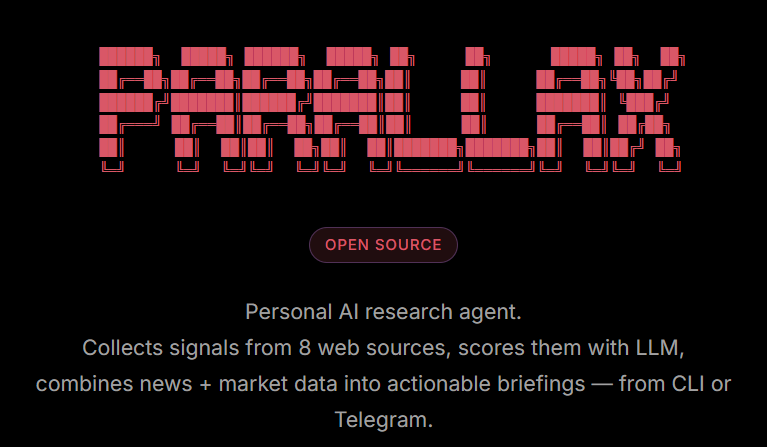

[](https://python.org)
[](https://langchain.com)
[](https://trychroma.com)
[](https://core.telegram.org/bots)
[](LICENSE)

Personal AI research agent. Collects signals from 8 web sources, scores them with LLM, combines news + market data into actionable briefings — from CLI or Telegram.

---

## Features

**Web Intelligence** — Collects from Hacker News, Reddit, GitHub Trending, Product Hunt, Mastodon, Dev.to, Google Trends, and custom RSS in parallel. Deduplicates via MD5.

**RAG Knowledge Base** — Index local files (PDF, DOCX, CSV, MD) into ChromaDB. Ask questions — answers come from your own documents combined with collected intel.

**CCW Impact Scoring** — Every item is scored 1–10 by LLM for real-world impact. Scores rank news, prioritize briefing context, and trigger smart alerts at 7+.

| Score | Meaning |
|---|---|
| 9–10 | Major breakthrough |
| 7–8 | Significant shift worth acting on |
| 5–6 | Interesting, worth following |
| 1–4 | Routine noise |

**Market Data** — Live crypto (CoinGecko), stocks (Alpha Vantage + Finnhub), forex (open.er-api). All free APIs. SQLite history. Auto-alerts on big moves.

**Daily Briefing** — Signal themes, market analysis, dominant trend, capital flow, BUY/HOLD/AVOID verdict, 3 things to research today. Saved to `data/exports/`.

**Telegram Bot** — Full command set in Telegram. Send a file → indexed. Smart alerts pushed automatically. Morning briefing at your configured hour.

---

## Install

```bash
git clone https://github.com/ysz7/Parallax.git
cd Parallax
python -m venv .venv
.venv\Scripts\activate        # Windows
source .venv/bin/activate     # Linux / macOS
pip install -r requirements.txt
```

Pull local models (skip if using Anthropic):
```bash
ollama pull gemma3
ollama pull nomic-embed-text
```

---

## Configure

Create `.env` in the project root:

```env
# LLM — choose one
LLM_PROVIDER=ollama
OLLAMA_MODEL=gemma3

# or Anthropic (recommended for server — no GPU needed)
# LLM_PROVIDER=anthropic
# ANTHROPIC_API_KEY=sk-ant-...
# ANTHROPIC_MODEL=claude-sonnet-4-20250514

# Telegram
TELEGRAM_BOT_TOKEN=
TELEGRAM_ALLOWED_USER_ID=         # comma-separated for multiple users

# Auto-research interval in minutes (0 = off)
AUTO_RESEARCH_INTERVAL=360

# Morning briefing hour in 24h format (0 = off)
MORNING_BRIEFING_HOUR=8

# Optional
ALPHAVANTAGE_KEY=
FINNHUB_KEY=
REDDIT_SUBS=
MASTODON_INSTANCE=mastodon.social
GOOGLE_TRENDS_GEO=US
CRYPTO_COINS=bitcoin,ethereum,solana
STOCK_SYMBOLS=AAPL,NVDA,MSFT
FOREX_PAIRS=EUR,GBP,JPY
```

---

## Run

```bash
python cli.py   # local CLI
python bot.py   # Telegram bot

# Windows shortcuts (auto-activate venv):
start-cli.bat
start-bot.bat
```

---

## Commands

| Command | Description |
|---|---|
| `/research` | Collect all sources + CCW scoring + market snapshot |
| `/news [N]` | Last N items sorted by CCW score |
| `/briefing [days]` | Full briefing: signals + market + investment direction |
| `/predict [days]` | Cross-niche predictions with probabilities |
| `/flows [days]` | Sectors where money is moving now |
| `/ideas` | 5 business ideas based on current trends |
| `/market` | Crypto + stocks + forex live snapshot |
| `/report <topic>` | Deep research report on any topic |
| `/reports` | List / view / export / delete saved reports |
| `/rss list/add/remove` | Manage custom RSS feeds |
| `/remind <text>` | Natural language reminders (en + ru) |
| `/reminders` | List active reminders |
| `/stats` | Knowledge base stats + manage indexed files |
| `/tokens` | Anthropic API usage and cost |
| `/logs` | Recent error log |
| `/set lang <code>` | Response language: EN, RU, DE, etc. |

Any text → RAG search. File path or drag & drop → indexed automatically.

---

## Docker

```bash
docker compose up -d
```

```yaml
services:
  bot:
    build: .
    env_file: .env
    volumes:
      - ./data:/app/data
    restart: unless-stopped
```
